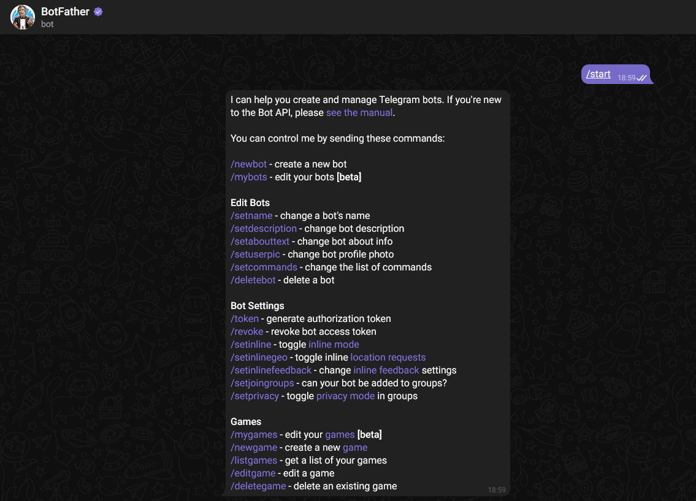
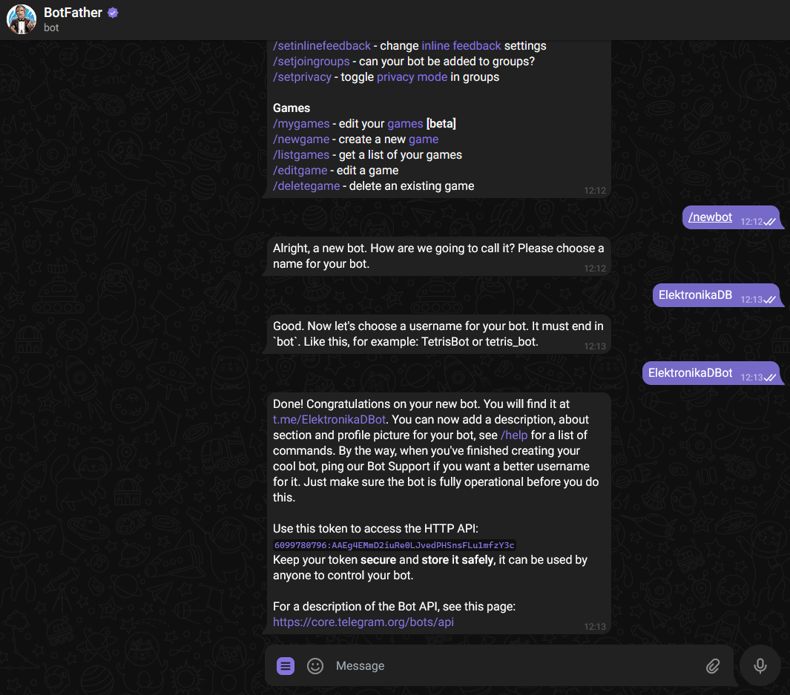
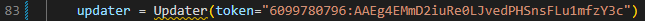

# YOLO - Jetson Nano

Procedure to make inference in Jetson Nano with yolo-v7. [Here](Object_detection_methods.md) you could find more information about object detection methods

## Set up Jetson Nano

Go to [this](https://developer.nvidia.com/embedded/learn/get-started-jetson-nano-devkit#intro) step by step tutorial. But do it with [this](https://ln5.sync.com/dl/741c98fe0/x8kxkhgs-cgmzk7rf-n4m7pyw8-h64tzbv5/view/default/11304846510004) image of [ubuntu20](https://github.com/Qengineering/Jetson-Nano-Ubuntu-20-image)

## Install dependecies and download packages

Firs of all we will have to install python dependecies. For that open a terminal an execute the followin commands.

```bash
sudo apt-get update
sudo apt-get install python-testresources -y
apt-get install python3.8 -y
apt-get install python3.8-dev -y
sudo apt-get install nvidia-tensorrt -y
```

```bash
wget https://files.pythonhosted.org/packages/b7/2d/ad02de84a4c9fd3b1958dc9fb72764de1aa2605a9d7e943837be6ad82337/pip-21.0.1.tar.gz 68
tar -xzvf pip-21.0.1.tar.gz
cd pip-21.0.1
sudo python3.8 setup.py install

pip3 -V
```

Modify /usr/bin/pip file as:

```bash
sudo vim /usr/bin/pip

# press 'a' and make changes #!/usr/bin/python3.6 to #!/usr/bin/python3.8

# then press Esc
# and type ':wq'
# press enter
```

Select the python version you want to run as default

```bash
sudo update-alternatives --install /usr/bin/python python /usr/bin/python3.8 1
sudo update-alternatives --config python
```

```bash
pip install --upgrade setuptools pip --user
pip install --ignore-installed PyYAML
pip install Pillow
pip install python-telegram-bot
pip install nvidia-pyindex
pip install opencv-python
```

For Pytorch installation, first we need to install dependencies and check the Jetpack version:

```bash
sudo apt-get -y update;
sudo apt-get -y install autoconf bc build-essential g++-8 gcc-8 clang-8 lld-8 gettext-base gfortran-8 iputils-ping libbz2-dev libc++-dev libcgal-dev libffi-dev libfreetype6-dev libhdf5-dev libjpeg-dev liblzma-dev libncurses5-dev libncursesw5-dev libpng-dev libreadline-dev libssl-dev libsqlite3-dev libxml2-dev libxslt-dev locales moreutils openssl python-openssl rsync scons python3-pip libopenblas-dev
```

```bash
pip install --upgrade pip
pip install --upgrade protobuf
pip install aiohttp numpy=='1.19.4' scipy=='1.5.3' 
export "LD_LIBRARY_PATH=/usr/lib/llvm-8/lib:$LD_LIBRARY_PATH"
pip install --no-cache https://developer.download.nvidia.com/compute/redist/jp/v461/pytorch/torch-1.11.0a0+17540c5+nv22.01-cp36-cp36m-linux_aarch64.whl
```

```bash
git clone --recursive --branch 1.7 http:/github.com/pytorch/pytorch
cd pytorch
pip install -r requirements.txt
python3.8 setup.py install
```

After having installed the dependencies there are two options. One is to just use the yolov7.trt file to run the program and the second one is to do all from scratch. Both of them are explained bellow.

## Telegram bot creation

* Search for @botfather in Telegram.


* Start a conversation with BotFather by clicking on the Start button.



* Type `/newbot`, and follow the prompts to set up a new bot. The BotFather will give you a token that you will use to authenticate bot and grant it access to the Telegram API.



## Run inference

First of all we need to clone the repository and go to the folder.

```bash
git clone https://github.com/mikelalda/Alarm-Yolo.git

cd Alarm-Yolo
```

In the file main.py we need to change the line 83 with our token.



Once having done all the steps, run this in the terminal.

```bash
python main.py --model_path models/yolov7-tiny-nms.trt
```

## To make a custom YOLOv7 Tensorrt file

After having installed the dependencies and opencv, download the yolov7 implementation and the needed weights. There are more weights into [this](https://github.com/WongKinYiu/yolov7/releases) folder

```bash
git clone https://github.com/WongKinYiu/yolov7
cd yolov7
ls

wget https://github.com/WongKinYiu/yolov7/releases/download/v0.1/yolov7-tiny.pt
```

Then this model is exported to onnx usin the script provided by the repository owner.

```bash
python export.py --weights ./yolov7-tiny.pt --grid --end2end --simplify --topk-all 100 --iou-thres 0.65 --conf-thres 0.35 --img-size 640 640
ls
```

That onnx model can be checked with [Netron](https://netron.app), an APP for visualising ONNX models.

After that the onnx model is converted to tensorrt (Trt) model with another repository usage.

```bash
cd ../
git clone https://github.com/Linaom1214/tensorrt-python.git
cd tensorrt-python
python export.py -o /content/yolov7/yolov7-tiny.onnx -e ./yolov7-tiny-nms.trt -p fp16
ls
```

Now the model is ready to use with Trt

## To increase the performance, install opencv with gpu

To install opencv with gpu capability. Follow this steps (see the [link](https://qengineering.eu/install-opencv-4.5-on-jetson-nano.html) for more information):

1- Enable the installation

```bash
# a fresh start, so check for updates
sudo apt-get update
# sudo apt-get upgrade
# install nano
sudo apt-get install nano -y
# install dphys-swapfile
sudo apt-get install dphys-swapfile -y
# enlarge the boundary (4.5.2 and higher) 
sudo nano /sbin/dphys-swapfile
# change the varibale value
# CONF_MAXSWAP=4096
# reboot afterwards

```

2- Install the repo and OpenCV

```bash
git clone Alarm-Yolo
cd Alarm_Yolo
sudo chmod 755 ./OpenCV-4-6-0.sh
./OpenCV-4-6-0.sh
# once the installation is done...
# remove the dphys-swapfile now
sudo /etc/init.d/dphys-swapfile stop
sudo apt-get remove --purge dphys-swapfile
# just a tip to save an additional 275 MB
sudo rm -rf ~/opencv
sudo rm -rf ~/opencv_contrib 
```
